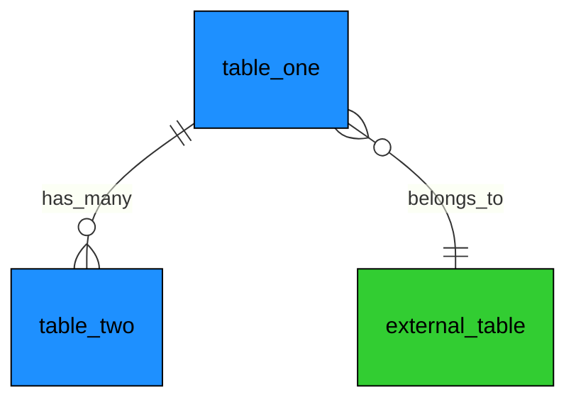

# Domain Template

Use this template when creating new data model documentation.

---

# <Domain Name> Data Model

## Overview

Brief description of what this domain manages and its purpose in the system.

## Mermaid Diagram

**Color Guide**: Each domain has a unique color. Tables from other domains use their assigned colors.

## Table Structure

### table_one

| Field       | Type      | Constraints             | Description                              |
| ----------- | --------- | ----------------------- | ---------------------------------------- |
| id          | STRING    | PRIMARY KEY             | Unique identifier (UUID)                 |
| name        | STRING    | NOT NULL, UNIQUE        | Display name                             |
| status      | STRING    | NOT NULL                | Status enum (ACTIVE, INACTIVE, DELETED)  |
| type        | STRING    | NOT NULL                | Type enum (TYPE_A, TYPE_B)               |
| parent_id   | STRING    | FK -> external_table.id | Reference to parent                      |
| priority    | INTEGER   | NULL                    | Priority level (1-10)                    |
| metadata    | JSONB     | NULL                    | Flexible metadata storage                |
| created_at  | TIMESTAMP | NOT NULL, DEFAULT NOW() | Creation timestamp                       |
| updated_at  | TIMESTAMP | NOT NULL, DEFAULT NOW() | Last update timestamp                    |

### table_two

| Field        | Type      | Constraints              | Description                    |
| ------------ | --------- | ------------------------ | ------------------------------ |
| id           | STRING    | PRIMARY KEY              | Unique identifier (UUID)       |
| table_one_id | STRING    | FK -> table_one.id       | Parent reference               |
| key          | STRING    | NOT NULL                 | Metadata key                   |
| value        | STRING    | NOT NULL                 | Metadata value                 |
| is_active    | BOOLEAN   | NOT NULL, DEFAULT TRUE   | Active flag                    |
| created_at   | TIMESTAMP | NOT NULL, DEFAULT NOW()  | Creation timestamp             |

## Enumeration Definitions

### StatusEnum

| Value     | Description                        |
| --------- | ---------------------------------- |
| ACTIVE    | Entity is currently active         |
| INACTIVE  | Entity is temporarily inactive     |
| DELETED   | Entity is soft-deleted             |

### TypeEnum

| Value   | Description                      |
| ------- | -------------------------------- |
| TYPE_A  | First category of entities       |
| TYPE_B  | Second category of entities      |

## Business Rules

1. **Name Uniqueness**: Each entity name must be unique within its parent scope
2. **Status Transitions**: ACTIVE -> INACTIVE -> DELETED (no reverse transitions)
3. **Priority Range**: Priority values must be between 1 and 10 inclusive
4. **Soft Delete**: Entities are never hard-deleted, only marked as DELETED

## Relationships

| From Table | Field        | To Table       | Type     | Description                    |
| ---------- | ------------ | -------------- | -------- | ------------------------------ |
| table_one  | parent_id    | external_table | many-to-one | Each entity belongs to parent |
| table_two  | table_one_id | table_one      | many-to-one | Metadata belongs to entity    |

## Indices

| Index Name              | Table     | Fields            | Purpose                          |
| ----------------------- | --------- | ----------------- | -------------------------------- |
| idx_table_one_status    | table_one | status            | Filter by status                 |
| idx_table_one_parent    | table_one | parent_id         | Query by parent                  |
| idx_table_two_parent    | table_two | table_one_id, key | Efficient metadata lookups       |
